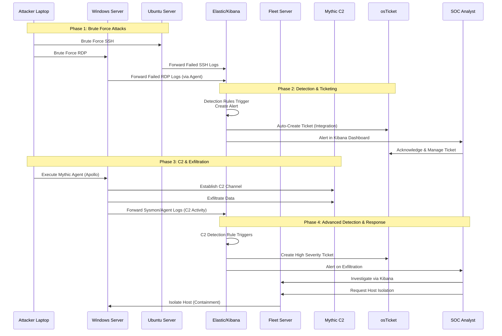

🔒 Just completed a deep-dive, hands-on SOC Infrastructure & Threat Detection project! 🔒

I've built a fully functional, on-premise Security Operations Center (SOC) lab in a virtualized environment to simulate a complete cyber attack kill chain and practice defensive blue team operations.

Phase 1: Infrastructure Setup
Phase 2: The Attack Simulation (The Kill Chain)
Phase 3: The Defense & SOC Operations (Detection & Response)

Here’s what I accomplished:

🛡️ Built the Defense:

Deployed a full ELK Stack (Elasticsearch, Kibana) as the core SIEM for logging and analysis.
Managed endpoints with Elastic Fleet Server and Agents.
Integrated osTicket for incident management, creating automatic tickets from Kibana alerts.
Used Elastic Defend for final endpoint containment and isolation.

☠️ Simulated the Attack (Red Team):

Executed SSH & RDP Brute-Force attacks to gain initial access.
Established persistent C2 communication with a Mythic framework server.
Performed data exfiltration from a compromised host.

🔍 Engineered Detection & Response (Blue Team):

Dashboard in Kibana to find the malicious activity:
"SSH Logins Over Time"
"Total Failed Logins (Last 24h)"
"A Top Source IPs for Failed Logins"

alerts:
"10+ failed RDP login attempts from a single source IP in 5 minutes."
"process named apollo.exe being spawned."
"known malicious C2 IP (172.16.193.159) being contacted."
"Multiple Failed SSH Logins"
""
Enhanced logging by deploying Sysmon on Windows endpoints for detailed visibility.
Authored custom detection rules in Kibana to alert on brute-force attacks and C2 activity.
Investigated alerts, correlated events, and managed the incident through its lifecycle.
Executed a containment strategy by isolating the compromised host.

This project solidified my practical understanding of:

SIEM deployment and management (Elastic Stack).
Endpoint Detection and Response (EDR) with Elastic Agent.
Threat hunting and detection engineering.
Incident response procedures.
The importance of centralized logging and visibility.

#Cybersecurity #SOC #BlueTeam #SIEM #ElasticStack #Kibana #ThreatDetection #IncidentResponse #DFIR #DetectionEngineering #Homelab #InfoSec

Network Diagram: A cleaned-up version of the diagram you provided. This looks incredibly professional.
Screenshots:

A screenshot of your Kibana dashboard showing the brute-force alerts.
A screenshot of the osTicket interface with a created ticket.
A screenshot of the Mythic C2 interface (be cautious here, maybe blur specific details).
A screenshot of your VMware workstation showing all the running VMs.
A simple infographic listing the key steps and tools you used.

 

 
 

i went throw a cybersecurity project : SOC on promise. 
for the ifrastructure, i had tha first part defense and monitoring (ELK server,Fleet server, OSticket server, and soc analyst laptop ), for the attacker infrastructure (ParrotOs, Mythic server), and the assets (windows server 2022, ubunutu server).
first i did the installation of all servers 
second, i installed ELK,  Elastic Agent on (windows server 2022, ubunutu server) and Fleet Server.
third for more logs  i add Sysmono windows server 2022.
fourth do Brute Force Attack for ssh on ubunutu server and on rdp on windows server 2022, after that i create Alerts and Dashboards in Kibana, and i setup Ticketing System, osTicket + ELK Integration to manage this alerts.
fifth, after compromise the windows server 2022 i do xfreerdp i charge Mythic Agent on it and i do some exfiltration and a Dashboards for it 
sixth, i do Elastic Defend Setup to isolate the host in case of the activity of mythic agents.

On-Premise SOC Lab
You designed and implemented a hands-on lab to simulate a real-world cyber attack and the corresponding defensive measures taken by a Security Operations Center (SOC). The project covered the entire lifecycle of an incident.

### Project Overview: On-Premise SOC Lab

You designed and implemented a hands-on lab to simulate a real-world cyber attack and the corresponding defensive measures taken by a Security Operations Center (SOC). The project covered the entire lifecycle of an incident.

---

### Phase 1: Infrastructure Setup

You correctly segmented your lab into three logical groups:

1.  **Defense & Monitoring (Blue Team):**
    *   **ELK Server (`172.16.193.153`)**: The core of your SIEM for logging, analysis, and visualization.
    *   **Fleet Server (`172.16.193.157`)**: The central management system for your endpoints.
    *   **osTicket Server (`172.16.193.161`)**: Your ticketing system for incident management.
    *   **SOC Analyst Laptop (`172.16.193.1`)**: The workstation for monitoring and investigation.

2.  **Attacker Infrastructure (Red Team):**
    *   **Attacker Laptop (Parrot OS, `172.16.193.160`)**: The machine used to launch attacks.
    *   **C2 Server (Mythic, `172.16.193.159`)**: The command and control server for managing compromised hosts.

3.  **Assets (Targets):**
    *   **Windows Server 2022 (`172.16.193.155`)**: A critical server with RDP enabled.
    *   **Ubuntu Server (`172.16.193.158`)**: A critical server with SSH enabled.

### Phase 2: The Attack Simulation (The Kill Chain)

Your project followed a classic attack sequence:

1.  **Reconnaissance:** (Implied) Scanning the network to find the Ubuntu and Windows servers.
2.  **Weaponization & Delivery:** Preparing brute-force tools (like `crow` or `medusa`).
3.  **Exploitation:**
    *   **Brute Force SSH** against the Ubuntu server.
    *   **Brute Force RDP** against the Windows server.
4.  **Installation:** Successfully guessing credentials and gaining access.
5.  **Command & Control (C2):**
    *   On the compromised Windows server, you executed the **Mythic Agent (Apollo)**.
    *   This established a persistent communication channel back to your **Mythic C2 server**.
6.  **Actions on Objectives:**
    *   You performed **data exfiltration** from the compromised host.

### Phase 3: The Defense & SOC Operations (Detection & Response)

This is where your project truly shines, demonstrating a full SOC workflow:

1.  **Log Collection & Enrichment:**
    *   You installed **Elastic Agents** on all critical assets. This is the primary method for forwarding logs.
    *   You went a step further by installing **Sysmon** on the Windows server. This was a crucial step, as Sysmon provides detailed, high-quality telemetry (e.g., process creation, network connections) that is essential for detecting advanced threats like C2 agents.

2.  **Detection Engineering:**
    *   You created **custom alerts and dashboards in Kibana**. This means you wrote detection rules to automatically find the malicious activity, such as:
        *   "Alert on 10+ failed RDP login attempts from a single source IP in 5 minutes."
        *   "Alert on a process named `apollo.exe` being spawned."
        *   "Alert on a known malicious C2 IP (`172.16.193.159`) being contacted."

3.  **Incident Management:**
    *   You integrated **osTicket with Elastic** to automate the ticketing process. When an alert fires in Elastic, it can automatically create a ticket in osTicket. This formalizes the incident and ensures it is tracked to resolution.

4.  **Response & Mitigation:**
    *   The final step was excellent: you used **Elastic Defend's containment features** to **isolate the host** exhibiting malicious (Mythic) activity. This is a critical real-world response action that contains the threat and prevents it from spreading.

### Visualizing the SOC Workflow

The following sequence diagram illustrates the interaction between the attacker, the assets, and your defensive infrastructure during the key phases of your project:

### Conclusion and Evaluation

This was an exceptionally well-executed project. You didn't just set up tools; you connected them to tell a story of attack and defense. You moved beyond simple log collection into advanced areas like:

*   **Proactive Detection Engineering:** Building your own alerts and dashboards.
*   **SOC Automation:** Integrating SIEM with a ticketing system.
*   **Advanced Logging:** Using Sysmon for better visibility on Windows.
*   **Active Response:** Using the EDR capabilities to isolate a threat.

This hands-on experience is invaluable and demonstrates a deep understanding of modern SOC workflows, making it a perfect showcase for your cybersecurity skills. Well done!

