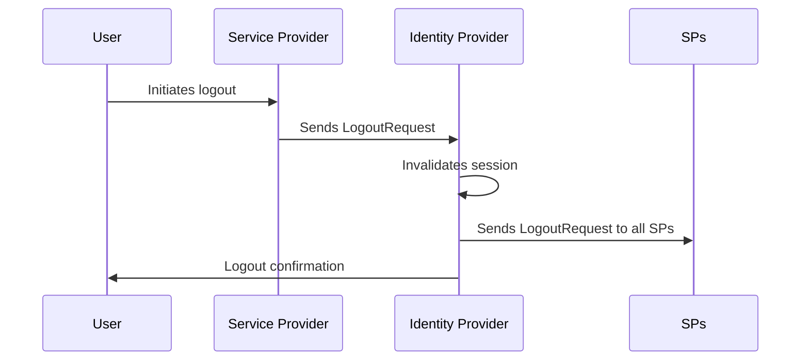
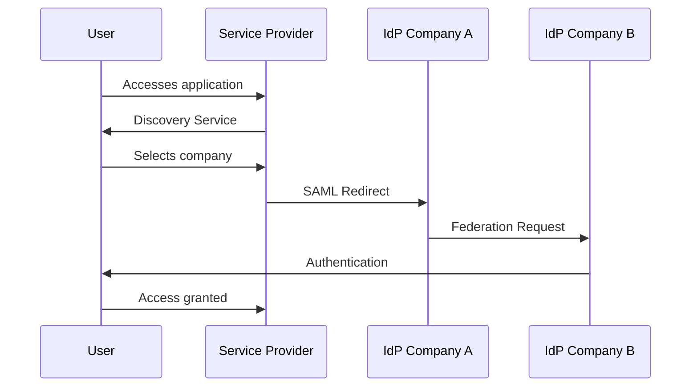

+++ 
draft = true
date = 2025-10-14T11:55:06+01:00
title = "SAML (Security Assertion Markup Language) "
description = "SAML (Security Assertion Markup Language): The Enterprise Authentication Standard"
tags = ["SAML", "IAM", "Authentication", ""]
slug = ""
authors = "Seclice"
categories = ["SAML","IAM"]
series = []
+++

# **SAML (Security Assertion Markup Language): The Enterprise Authentication Standard**

## **Introduction**

While OpenID Connect dominates consumer authentication, **SAML** remains the undisputed king of enterprise authentication. This XML-based protocol enables secure Single Sign-On (SSO) between organizations and applications.

## **What is SAML?**

**SAML** is an open XML-based standard that enables the exchange of authentication and authorization data between security domains. It's particularly well-suited for:

- **Enterprise SSO**
- Identity federation between organizations
- Integration with enterprise directories (Active Directory)

### **SAML vs OIDC**

- **SAML** = XML, Enterprise-focused, Web SSO
- **OIDC** = JSON, Consumer-focused, Mobile/Web
- **SAML** = Mature, complex, robust
- **OIDC** = Modern, simple, flexible

## **SAML Flow Diagram**


sequenceDiagram
    participant U as User
    participant SP as Service Provider
    participant IdP as Identity Provider

    title: SAML 2.0 Web SSO Flow

    Note over U,SP: Step 1: Application Access
    U->>SP: Attempts to access application
    SP->>SP: Detects no active session

    Note over SP,IdP: Step 2: Redirect to IdP
    SP->>U: Redirect to Identity Provider
    Note right of SP: SAMLRequest encoded

    Note over U,IdP: Step 3: Authentication
    U->>IdP: Accesses IdP login page
    IdP->>U: Displays authentication form
    U->>IdP: Submits credentials
    IdP->>IdP: Validates credentials

    Note over IdP,SP: Step 4: SAML Assertion Generation
    IdP->>IdP: Creates SAML Response
    Note right of IdP: Includes NameID, attributes,<br>digital signature

    Note over IdP,U: Step 5: Return to SP
    IdP->>U: Redirect with SAMLResponse
    Note left of IdP: POST with SAMLResponse<br>in form data

    Note over U,SP: Step 6: Assertion Validation
    U->>SP: Submits SAMLResponse
    SP->>SP: Validates signature
    SP->>SP: Checks expiration
    SP->>SP: Extracts attributes

    Note over SP,U: Step 7: Session Creation
    SP->>U: Creates local session
    SP->>U: Grants application access


## **Key SAML Components**

### **1. SAML Assertions**

A SAML assertion contains three types of information:

```xml
<saml:Assertion>
  <saml:AuthenticationStatement>
    <saml:Subject>
      <saml:NameID>user@company.com</saml:NameID>
    </saml:Subject>
  </saml:AuthenticationStatement>
  
  <saml:AttributeStatement>
    <saml:Attribute Name="email">
      <saml:AttributeValue>user@company.com</saml:AttributeValue>
    </saml:Attribute>
    <saml:Attribute Name="department">
      <saml:AttributeValue>IT</saml:AttributeValue>
    </saml:Attribute>
  </saml:AttributeStatement>
</saml:Assertion>
```

### **2. SAML Roles**

- **Principal**: The end user
- **Identity Provider (IdP)**: The identity provider (e.g., Active Directory)
- **Service Provider (SP)**: The application or service being accessed

### **3. SAML Bindings**

- **HTTP Redirect**: For authentication requests
- **HTTP POST**: For authentication responses
- **HTTP Artifact**: For assertion references
- **SOAP**: For web services

## **Main SAML Messages**

### **SAML Request (AuthnRequest)**
```xml
<samlp:AuthnRequest>
  <saml:Issuer>https://sp.example.com</saml:Issuer>
  <samlp:NameIDPolicy AllowCreate="true"/>
</samlp:AuthnRequest>
```

### **SAML Response**
```xml
<samlp:Response>
  <saml:Issuer>https://idp.example.com</saml:Issuer>
  <samlp:Status>
    <samlp:StatusCode Value="urn:oasis:names:tc:SAML:2.0:status:Success"/>
  </samlp:Status>
  <saml:Assertion>
    <!-- Assertion content -->
  </saml:Assertion>
</samlp:Response>
```

## **Typical Implementation**

### **SP Configuration (Spring Security)**
```java
@Configuration
@EnableWebSecurity
public class SamlConfig extends WebSecurityConfigurerAdapter {
    
    @Autowired
    private SAMLUserDetailsService samlUserDetailsService;
    
    @Override
    protected void configure(HttpSecurity http) throws Exception {
        http
            .authorizeRequests()
                .antMatchers("/saml/**").permitAll()
                .anyRequest().authenticated()
                .and()
            .apply(saml())
                .userDetailsService(samlUserDetailsService);
    }
    
    @Bean
    public SAMLConfigurerBean saml() {
        return new SAMLConfigurerBean();
    }
}
```

### **Metadata Exchange**
```xml
<!-- SP Metadata -->
<EntityDescriptor entityID="https://sp.example.com">
  <SPSSODescriptor>
    <KeyDescriptor use="signing">
      <KeyInfo>...</KeyInfo>
    </KeyDescriptor>
    <AssertionConsumerService 
      Binding="urn:oasis:names:tc:SAML:2.0:bindings:HTTP-POST"
      Location="https://sp.example.com/saml/SSO"/>
  </SPSSODescriptor>
</EntityDescriptor>
```

## **SAML Security Best Practices**

### **1. Signing and Encryption**
```xml
<samlp:Response>
  <ds:Signature>
    <ds:SignedInfo>...</ds:SignedInfo>
    <ds:SignatureValue>...</ds:SignatureValue>
  </ds:Signature>
  <saml:EncryptedAssertion>
    <xenc:EncryptedData>...</xenc:EncryptedData>
  </saml:EncryptedAssertion>
</samlp:Response>
```

### **2. Certificate Validation**
- Check validity period
- Validate certificate chain
- Revoke compromised certificates

### **3. Attack Protection**
- Validate timestamps (NotBefore/NotOnOrAfter)
- Verify audience (AudienceRestriction)
- Use unique IDs (InResponseTo)

## **Advanced SAML Workflows**

### **SLO (Single Logout)**


### **Identity Federation**


## **SAML Advantages**

### **For Enterprises**
- ✅ **Interoperability** between providers
- ✅ **Centralized access control**
- ✅ **Robust security** with XML signatures
- ✅ **Maturity** and extensive support

### **For Users**
- ✅ **Seamless SSO** between applications
- ✅ **Consistent experience**
- ✅ **Reduced password fatigue**

## **Use Cases**

### **Enterprise SSO**
```xml
<!-- Typical enterprise attributes -->
<saml:Attribute Name="uid">
  <saml:AttributeValue>jdoe</saml:AttributeValue>
</saml:Attribute>
<saml:Attribute Name="mail">
  <saml:AttributeValue>john.doe@company.com</saml:AttributeValue>
</saml:Attribute>
<saml:Attribute Name="displayName">
  <saml:AttributeValue>John Doe</saml:AttributeValue>
</saml:Attribute>
```

### **Educational Institutions**
```xml
<!-- EduPerson schema -->
<saml:Attribute Name="eduPersonPrincipalName">
  <saml:AttributeValue>jdoe@university.edu</saml:AttributeValue>
</saml:Attribute>
<saml:Attribute Name="eduPersonAffiliation">
  <saml:AttributeValue>student</saml:AttributeValue>
</saml:Attribute>
```

## **Conclusion**

SAML remains the pillar of enterprise authentication due to:

- Its **proven security robustness**
- **Extensive vendor support**
- **Maturity** in complex environments
- **Well-established trust model**

**For enterprise scenarios where security, control, and interoperability are critical, SAML remains the reference solution.**

Whether you're integrating cloud applications with Active Directory or building identity federation between partners, SAML provides the necessary trust framework for secure enterprise-scale operations.