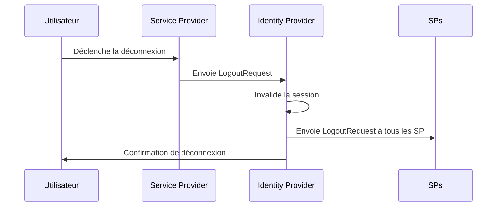
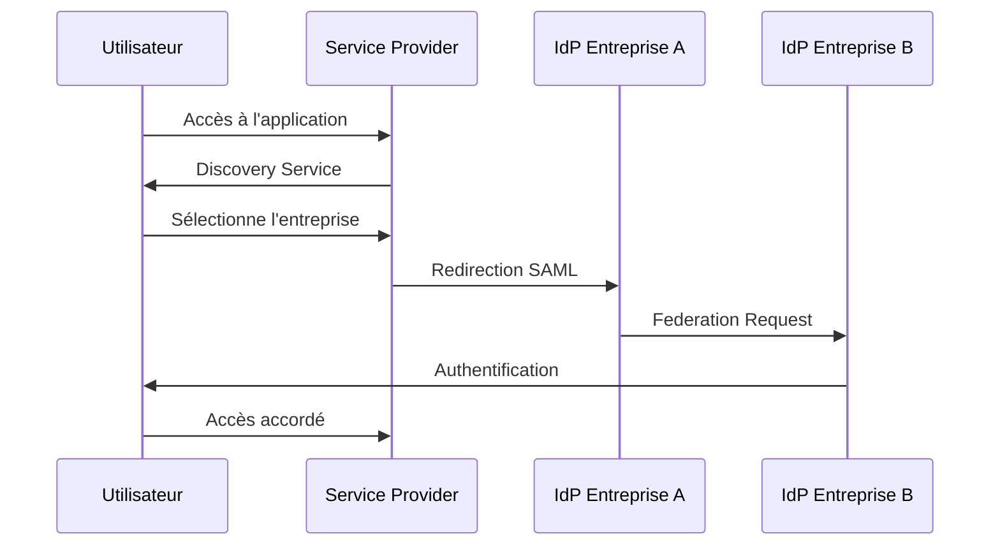

+++ 
draft = true
date = 2025-10-14T11:55:02+01:00
title = " SAML (Security Assertion Markup Language)  "
description = "SAML (Security Assertion Markup Language) : Le standard d'authentification d'entreprise"
tags = ["SAML", "IAM", "Authentication", ""]
slug = ""
authors = "Seclice"
categories = ["SAML","IAM"]
series = []
+++

# **SAML (Security Assertion Markup Language) : Le standard d'authentification d'entreprise**

## **Introduction**

Alors qu'OpenID Connect domine l'authentification grand public, **SAML** reste le roi incontesté de l'authentification en entreprise. Ce protocole XML-based permet le Single Sign-On (SSO) sécurisé entre organisations et applications.

## **Qu'est-ce que SAML ?**

**SAML** est un standard ouvert basé sur XML qui permet l'échange de données d'authentification et d'autorisation entre domaines de sécurité. Il est particulièrement adapté pour :

- Le **SSO Enterprise**
- Les fédérations d'identité entre organisations
- L'intégration avec les annuaires d'entreprise (Active Directory)

### **SAML vs OIDC**

- **SAML** = XML, Enterprise-focused, Web SSO
- **OIDC** = JSON, Consumer-focused, Mobile/Web
- **SAML** = Mature, complexe, robuste
- **OIDC** = Moderne, simple, flexible

## **Le flux SAML en diagramme**


sequenceDiagram
    participant U as Utilisateur
    participant SP as Service Provider
    participant IdP as Identity Provider

    title: SAML 2.0 Web SSO Flow

    Note over U,SP: Étape 1 : Accès à l'application
    U->>SP: Tente d'accéder à l'application
    SP->>SP: Vérifie l'absence de session

    Note over SP,IdP: Étape 2 : Redirection vers l'IdP
    SP->>U: Redirection vers l'IdP
    Note right of SP: SAMLRequest encoded

    Note over U,IdP: Étape 3 : Authentification
    U->>IdP: Accède à la page de login IdP
    IdP->>U: Affiche le formulaire d'authentification
    U->>IdP: Soumet les credentials
    IdP->>IdP: Valide les credentials

    Note over IdP,SP: Étape 4 : Génération de l'assertion SAML
    IdP->>IdP: Crée la SAML Response
    Note right of IdP: Inclut NameID, attributes,<br>signature numérique

    Note over IdP,U: Étape 5 : Retour vers le SP
    IdP->>U: Redirection avec SAMLResponse
    Note left of IdP: POST avec SAMLResponse<br>dans le formulaire

    Note over U,SP: Étape 6 : Validation de l'assertion
    U->>SP: Soumet la SAMLResponse
    SP->>SP: Valide la signature
    SP->>SP: Vérifie l'expiration
    SP->>SP: Extrait les attributs

    Note over SP,U: Étape 7 : Création de session
    SP->>U: Crée la session locale
    SP->>U: Accès à l'application accordé


## **Les composants clés de SAML**

### **1. Les assertions SAML**

Une assertion SAML contient trois types d'information :

```xml
<saml:Assertion>
  <saml:AuthenticationStatement>
    <saml:Subject>
      <saml:NameID>user@company.com</saml:NameID>
    </saml:Subject>
  </saml:AuthenticationStatement>
  
  <saml:AttributeStatement>
    <saml:Attribute Name="email">
      <saml:AttributeValue>user@company.com</saml:AttributeValue>
    </saml:Attribute>
    <saml:Attribute Name="department">
      <saml:AttributeValue>IT</saml:AttributeValue>
    </saml:Attribute>
  </saml:AttributeStatement>
</saml:Assertion>
```

### **2. Les rôles dans SAML**

- **Principal**: L'utilisateur final
- **Identity Provider (IdP)**: Le fournisseur d'identité (ex: Active Directory)
- **Service Provider (SP)**: L'application ou service à accéder

### **3. Les bindings SAML**

- **HTTP Redirect**: Pour les requêtes d'authentification
- **HTTP POST**: Pour les réponses d'authentification
- **HTTP Artifact**: Pour les références aux assertions
- **SOAP**: Pour les services web

## **Les messages SAML principaux**

### **SAML Request (AuthnRequest)**
```xml
<samlp:AuthnRequest>
  <saml:Issuer>https://sp.example.com</saml:Issuer>
  <samlp:NameIDPolicy AllowCreate="true"/>
</samlp:AuthnRequest>
```

### **SAML Response**
```xml
<samlp:Response>
  <saml:Issuer>https://idp.example.com</saml:Issuer>
  <samlp:Status>
    <samlp:StatusCode Value="urn:oasis:names:tc:SAML:2.0:status:Success"/>
  </samlp:Status>
  <saml:Assertion>
    <!-- Contenu de l'assertion -->
  </saml:Assertion>
</samlp:Response>
```

## **Implémentation typique**

### **Configuration du SP (Spring Security)**
```java
@Configuration
@EnableWebSecurity
public class SamlConfig extends WebSecurityConfigurerAdapter {
    
    @Autowired
    private SAMLUserDetailsService samlUserDetailsService;
    
    @Override
    protected void configure(HttpSecurity http) throws Exception {
        http
            .authorizeRequests()
                .antMatchers("/saml/**").permitAll()
                .anyRequest().authenticated()
                .and()
            .apply(saml())
                .userDetailsService(samlUserDetailsService);
    }
    
    @Bean
    public SAMLConfigurerBean saml() {
        return new SAMLConfigurerBean();
    }
}
```

### **Metadata Exchange**
```xml
<!-- Metadata du SP -->
<EntityDescriptor entityID="https://sp.example.com">
  <SPSSODescriptor>
    <KeyDescriptor use="signing">
      <KeyInfo>...</KeyInfo>
    </KeyDescriptor>
    <AssertionConsumerService 
      Binding="urn:oasis:names:tc:SAML:2.0:bindings:HTTP-POST"
      Location="https://sp.example.com/saml/SSO"/>
  </SPSSODescriptor>
</EntityDescriptor>
```

## **Bonnes pratiques de sécurité SAML**

### **1. Signature et chiffrement**
```xml
<samlp:Response>
  <ds:Signature>
    <ds:SignedInfo>...</ds:SignedInfo>
    <ds:SignatureValue>...</ds:SignatureValue>
  </ds:Signature>
  <saml:EncryptedAssertion>
    <xenc:EncryptedData>...</xenc:EncryptedData>
  </saml:EncryptedAssertion>
</samlp:Response>
```

### **2. Validation des certificats**
- Vérifier la période de validité
- Valider la chaîne de certificats
- Révoquer les certificats compromis

### **3. Protection contre les attaques**
- Valider les timestamps (NotBefore/NotOnOrAfter)
- Vérifier l'audience (AudienceRestriction)
- Utiliser des IDs uniques (InResponseTo)

## **Workflows avancés SAML**

### **SLO (Single Logout)**


### **Identity Federation**


## **Avantages de SAML**

### **Pour les entreprises**
- ✅ **Interopérabilité** entre fournisseurs
- ✅ **Contrôle centralisé** des accès
- ✅ **Sécurité robuste** avec signatures XML
- ✅ **Maturité** et support étendu

### **Pour les utilisateurs**
- ✅ **SSO transparent** entre applications
- ✅ **Expérience cohérente**
- ✅ **Réduction des mots de passe**

## **Conclusion**

SAML reste le pilier de l'authentification en entreprise grâce à :

- Sa **robustesse sécurité** éprouvée
- Son **support étendu** par les éditeurs
- Sa **maturité** dans les environnements complexes
- Son **modèle de confiance** bien établi

**Pour les scénarios enterprise où la sécurité, le contrôle et l'interopérabilité sont critiques, SAML demeure la solution de référence.**

Que vous intégriez des applications cloud avec Active Directory ou que vous construisiez une fédération d'identité entre partenaires, SAML fournit le cadre de confiance nécessaire pour des opérations sécurisées à l'échelle enterprise.